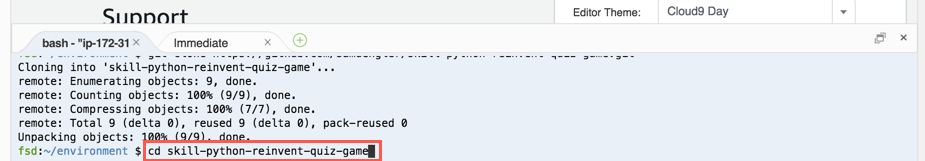

# Build An Alexa Quiz Skill in Python using ASK Python SDK

## Setting Up A Lambda Function Using Amazon Web Services

In the [first step of this guide](1-voice-user-interface.md), we built the Voice User Interface (VUI) for our Alexa skill.  On this page, we will be creating a Lambda function using [Amazon Web Services](http://aws.amazon.com).  You can [read more about what a Lambda function is](http://aws.amazon.com/lambda), but for the purposes of this guide, what you need to know is that Lambda is where our code lives.  When a user asks Alexa to use our skill, it is our Lambda function that interprets the appropriate interaction, and provides the conversation back to the user.

1.  **Go to http://aws.amazon.com and sign in to the console.** If you don't already have an account, you will need to create one.  [Check out this quick walkthrough for setting up a new AWS account](https://github.com/alexa/alexa-cookbook/blob/master/aws/set-up-aws.md).

    

2.  **Choose "Services" at the top of the screen, and type "Cloud9" in the search box.**  You can also find it in the list of services.  It is in the "Developer Tools" section.

    

3.  **Check your AWS region.** Lambda only works with the Alexa Skills Kit in four regions: US East (N. Virginia), EU (Ireland), and US West (Oregon).  Make sure you choose the region closest to your customers.

    

4.  **Click the "Create environment" button.**

    

5.  Enter a name for the Cloud9 Environment and **Click on "Next step".**  "samplePythonQuiz" is sufficient if you don't have another idea for a name.

    

6.  Leave the default values for Environment Settings and **Click on "Next step".**

7.  Review the Environment name and settings and **Click on "Create environment".**

    

7.  It will take a few minutes for the Cloud9 Environment to be created.

    

8.  When the Environment is ready, click into the blue Terminal window at the bottom of the IDE and type `git clone https://github.com/samdengler/skill-python-reinvent-quiz-game.git` and hit enter.  This will download the sample skill Git code repository.

    

9.  After the code is downloaded, type `cd skill-python-reinvent-quiz-game` and hit enter.

    

10. Next, type `pip install -r requirements.txt -t .` and hit enter. This will install the Python library dependencies, including the Alexa Skills Kit.

    

11. On the right navigation, click on AWS Resources and expand **skill-python-reinvent-quiz-game** to reveal the **MyFunction** Lambda function.  Double click on **MyFunction** to see the Alexa Skill Lambda function.

    

12. Select the **MyFunction** Lambda function in the right navigation and click the Deploy button to deploy the function in the Lambda service.

    

13. Open the AWS Console in a new browser window **http://console.aws.amazon.com**.

14. **Choose "Services" at the top of the screen, and type "Lambda" in the search box.**  You can also find it in the list of services.  It is in the "Compute" section.

    

15. In the list of Lambda Functions, click on the Function that begins with **cloud9-skill-python-reinvent-quiz-game-MyFunction.**

    

16. **Configure your trigger.** There are many different AWS services that can trigger a Lambda function, but for the purposes of this guide, we need to select "Alexa Skills Kit." from the left hand side.

    

    Once you have selected Alexa Skills Kit, scroll down and find the Skill ID verification section.  Although you will want to paste your skill's ID in the Skill ID field, however for this tutorial, click Disable.  Click the **Add** button in the lower right.

17. Click the orange **Save** button in the top right corner.

    

18. (Optional) Click the **Configure test events** dropdown menu on the top of the page.
  
    1. Select 'Alexa Start Session' from the 'Event Template' dropdown.
    2. Type `LaunchRequest` into the 'Event Name' field.
    3. Click the orange 'Create' button at the bottom of the page
    4. Click the **Test** button at the top of the page.
    5. You should see a light green box with the message: *Execution result: succeeded* at the top of the page.

19. **As a final step, copy the ARN value from the top right corner of the screen.** You will need this value in the next section of this guide.

  

